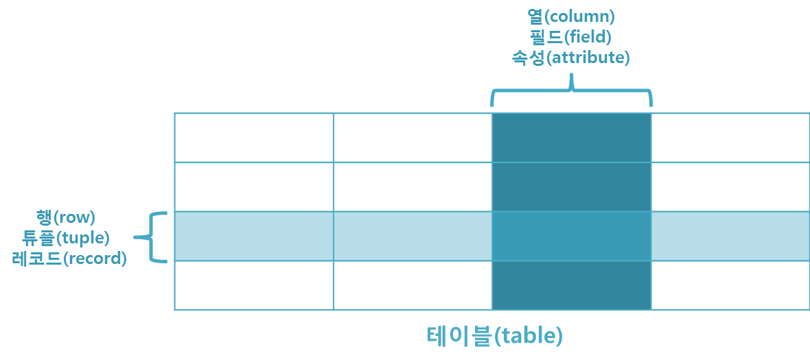
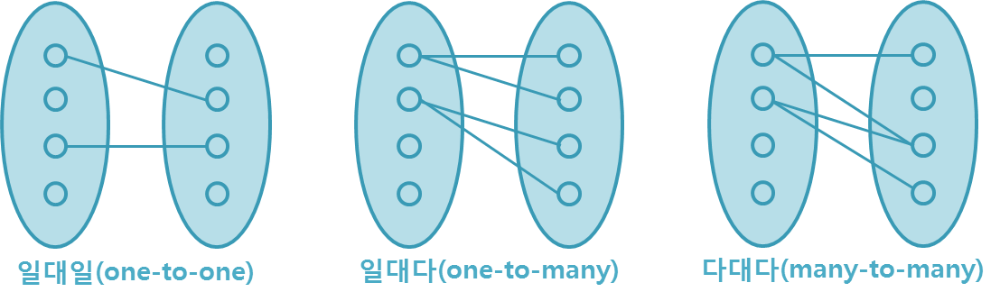

# 데이터베이스(DataBase) ?

## 데이터베이스란(DataBase)?
데이터베이스(DB:database)는 통합하여 관리되는 데이터의 집합체

중복된 데이터를 없애고 자료를 구조화하여 효율적인 처리를 할 수 있도록 관리됨
-> 여러 업무에 여러 사용자가 DB를 사용할 수 있음

DB는 응용프로그램과는 다른 별도의 미들웨어에 의해 관리됨

DB를 관리하는 미들웨어를 데이터베이스 관리 시스템(DBMS:Database Management System)이라고 함

 
 

## 데이터베이스 특징
1. 사용자의 질의에 대하여 즉각적인 처리와 응답이 이루어짐
2. 생성, 수정, 삭제를 통하여 항상 최신의 데이터를 유지함
3. 사용자들이 원하는 데이터를 동시에 공유할 수 있음
4. 사용자가 원하는 데이터를 주소가 아닌 내용에 따라 참조할 수 있음
5. 응용프로그램과 데이터베이스는 독립되어 있으므로, 데이터의 논리적 구조와 응용프로그램은 별개로 동작됨

 
 

## SQL(Structured Query Language)
DB에서 데이터를 정의, 조작, 제어하기 위해 사용하는 언어

목적에 따라 3가지로 나눌 수 있음

|속성|설명|주요 명령어|
|----|---|----------|
DDL(Data Definition Language)|데이터베이스나 테이블 등을 생성, 삭제하거나 그 구조를 변경하기 위한 명령어 | CREATE, ALTER, DROP|
DML(Data Mainpulation Language)|데이터베이스에 저장된 데이터를 처리하거나 조회, 검색하기 위한 명령어|INSERT, UPDATE, DELETE, SELECT 등|
DCL(Data Control Language)|데이터베이스에 저장된 데이터를 관리하기 위해 데이터의 보안성 및 무결성 등을 제어하기 위한 명령어(DCL명령어를 입력하는 순간 명령어에 해당하는 작업이 즉시(Auto Commit)완료 됨)|GRANT, REVOKE
TCL(Transaction Control Language)|DCL과 비슷한 맥락이나 트랜잭션을 제어할때 사용함|COMMIT, ROLLBACK 등

 
 

## 관계형 데이터베이스(relational database)
테이블(table)로 이루어져 있으며, 이 테이블은 키(key)와 값(value)의 관계를 나타냄

데이터의 종속성을 관계(relationship)로 표현하는 것이 특징임

테이블은 이름을 가지고 있으며, 행(row) 열(column) 대응하는 값을 가짐

 
 

## 관계형 데이터베이스 특징
1. 데이터의 분류, 정렬, 탐색 속도가 빠름
2. 오랫동안 사용된 만큼 신뢰성이 높고, 어떤 상황에서도 데이터의 무결성을 보장해 줌
3. 기존에 작성된 스키마를 수정하기 어려움
4. 데이터베이스의 부하를 분석하는것이 어려움

 
 

## 관계형 데이터베이스 용어
1. 열(coulumn) : 각각의 열은 유일한 이름을 가지고 있으며, 자신만의 타입을 가지고있음. 이러한 열은 필드(field) 또는 속성(attribute)라고 불림
2. 행(row) : 관계된 데이터의 묶음. 한 테이블의 모든 행은 같은 수의 열을 가지고 있음. 이러한 행은 튜플(tuple) 또는 레코드(record)라고 불림
3. 값(value) : 테이블은 각각의 행과 열에 대응하는 값을 가지고 있음. 이러한 값은 열의 타입에 맞는 값이어야 함
4. 키(key) : 테이블에서 행의 식별자로 이용되는 열을 키(key) 또는 기본 키 (primary key) 라고 함. 테이블에 지정된 레코드를 고유하게 식별하는 후보키(candidate key) 중에서 데이터베이스 설계자가 지정한 속성을 의미함
5. 관계(relationship) : 테이블 간의 관계는 관계를 맺는 테이블의 수에 따라 다름
   
    a. 일대일(one-to-one)관계
    b. 일대다(one-to-many)관계
    c. 다대다(many-to-many)관계

관계형 데이터베이스에서는 관계를 나타내기 위해 외래키(foreign key)를 사용함. 외래키는 한 테이블의 키 중에서 다른 테이블의 행(row)을 식별할 수 잇는 키를 의미함

6. 스키마(schema) : 테이블을 디자인하기 위한 청사진. 테이블의 각 열에 대한 항목과 타입뿐만 아니라 기본 키와 외래키도 나타내야 함

스키마는 개체-관계 다이어그램(entity-relationship diagram)이나 문자열로 표현할 수 있음
