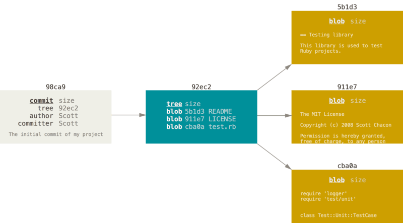
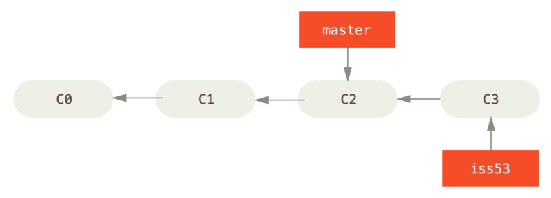

# Git 이란 ?

## Git? 
   
많이 들어봤지만 정확히 뭐하는건지 몰라서 항상 얼버무렸던 깃.. 마음먹고 정리해 보기로 하였다.
 
깃은 파일을 Committed, Modified, Staged 세가지 상태로 관리한다.
- Committed : 데이터가 로컬 데이터베이스에 안전하게 저장됨을 의미
- Modified : 수정한 파일을 아직 로컬 데이터베이스에 커밋하지 않은 것 의미
- Staged : 현재 수정한 파일을 곧 커밋할것이라고 표시하는 상태 의미

 

 
 
 

### 버전 관리 시스템
- 버전관리시스템(VCS) : 파일 변화를 시간에 따라 기록했다가 나중에 특정 시점의 버전을 다시 꺼내올 수 있는 시스템
 
 

1. 로컬 버전 관리(RCS)
: 기본적으로 Patch Set(파일에서 변경되는 부분)을 관리함

 
 
 

2. 중앙집중식 버전 관리(CVCS)
: 다른 개발자와 작업해야하는 경우가 발생하여 개발됨, 관리자는 누가 무엇을 할지 꼼꼼하게 관리 할 수 있음, 그러나 중앙 서버에 대한 문제가 있음

    

 
 
 

3. 분산 버전 관리 시스템(DVCS)
: 저장소를 히스토리와 더불어 전부 복제함, 클라이언트 중 아무나 골라서 서버를 복원 할 수 있음, 리모트 저장소가 많을 수 있어서 동시에 다양한 그룹과 다양한 방법으로 협업할 수 있음

 
 
 

## Git 브랜치 

Git은 데이터를 Change Set이나 변경사항(Diff)으로 기록하지 않고 일련의 스냅샷으로 기록함

Commit하면 Git은 현 Staging Area에 있는 데이터의 스냅샷에 대한 포인터, 저자나 커밋 메시지 같은 메타데이터, 이전 커밋에 대한 포인터 등을 포함하는 커밋 개체(Commit Object)를 저장함
이전 커밋포인터가 있어서 현재 커밋이 무엇을 기준으로 바뀌었는지 알 수 있음

최초 커밋을 제외한 나머지 커밋은 이전 커밋 포인터가 적어도 하나씩 있고 브랜치를 합친 Merge 커밋 같은 경우에는 이전 커밋 포인터가 여러개 있음

 
 
 

---
https://git-scm.com/

