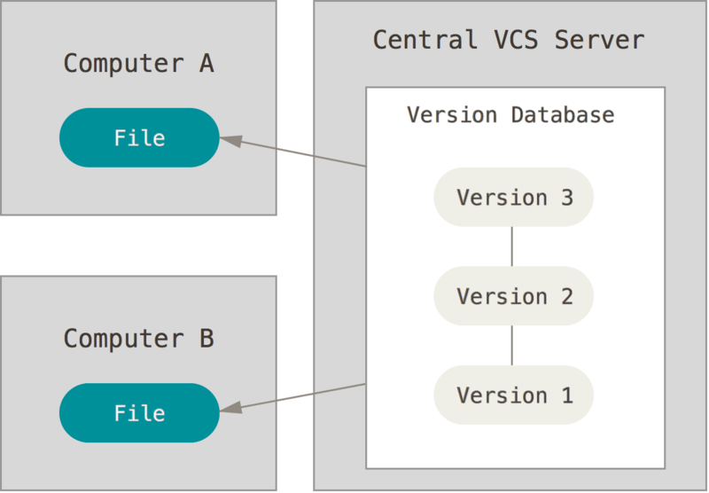

# Git 이란 ?

## Git? 
   
많이 들어봤지만 정확히 뭐하는건지 몰라서 항상 얼버무렸던 깃.. 마음먹고 정리해 보기로 하였다.

 

### 버전 관리 시스템
- 버전관리시스템(VCS) : 파일 변화를 시간에 따라 기록했다가 나중에 특정 시점의 버전을 다시 꺼내올 수 있는 시스템

1. 로컬 버전 관리(RCS)
: 기본적으로 Patch Set(파일에서 변경되는 부분)을 관리함

 
 
 

2. 중앙집중식 버전 관리(CVCS)
: 다른 개발자와 작업해야하는 경우가 발생하여 개발됨

 
 
 

1. 분산 버전 관리 시스템(DVCS)

 
 
 

---
https://git-scm.com/

